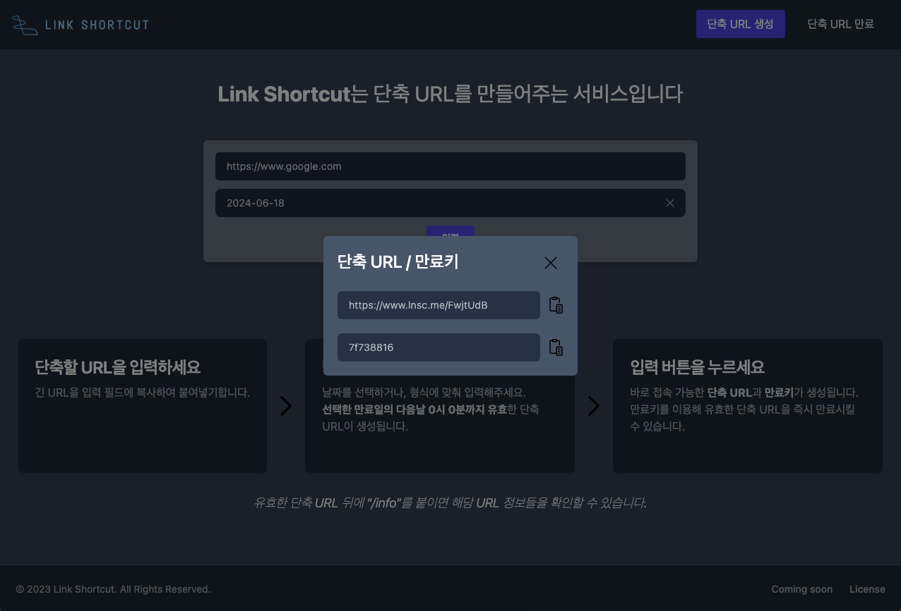

# Link Shortcut

> URL 단축 서비스

- 서비스 링크 : https://lnsc.me

---

## 서비스 개요

- 이력서 작성시 URL이 너무 길어 어려움을 겪던 중 URL 단축 서비스를 알게 되었고, 학습 목적으로 대규모 트래픽에도 안정적인 구조를 목표로 개인 프로젝트를 시작했습니다.
- 기존 URL 단축 서비스에 단축 URL 만료 & 단축 URL 정보 조회 기능을 추가하고, 서버 구조를 점진적으로 개선해나갔습니다. 또한 성능 테스트를 통해 개선된 구조의 실효성을 검증했습니다.
- 기존 Random 모듈을 사용하는 방식에서 Zookeeper를 이용한 단축 URL Path 생성하는 서버를 분리하여 대규모 트래픽에서도 안정적으로 단축 URL을 생성할 수 있도록 개선하였습니다.
- 일부 단축 URL에 트래픽이 몰리는 상황을 가정하여 캐시를 도입하고, 단축 URL 접속 기록 생성시 비동기로 작동하도록 개선하여 평균 응답시간 기준 약 29%의 성능을 향상시켰습니다.

---

## 서비스 기능

### 1. 단축 URL 생성

- **입력한 만료일 다음날 0시까지 사용가능**한 단축 URL을 생성할 수 있습니다.
- 단축 URL로 접속하면 입력했던 긴 URL 주소로 연결됩니다.
  
  

### 2. 단축 URL 즉시 만료

- 생성시에 발급된 만료키를 가지고, 유효한 단축 URL을 즉시 만료시킬 수 있습니다.
  
  

### 3. 단축 URL 정보 조회

- 유효한 단축 URL 주소 뒤에 */info*를 붙이면 단축 URL 정보 조회가 가능합니다.
- 단축 URL이 어떤 긴 URL 주소로 연결되어있는지, 언제 만료되는지, 언제 생성되었는지, 당일 접속 인원수와 생성 후 접속 인원수를 확인할 수 있습니다.
  

---

## 서비스 아키텍처

---

## ERD

---

## 팀원 & 회고

| [이용진](https://github.com/yjlee0235)      |
| ------------------------------------------- |
|  |

> 단순한 기능임에도 불구하고, 대규모 트래픽을 대비한다는 것은 고려할 점이 매우 많다는 것을 깨달았습니다. 그 과정에서 저의 부족한 부분이 어느 것인지 알게 되었고, 앞으로 나아가야 할 길이 멀다는 것을 알게 되었습니다.
> 해당 프로젝트가 학습을 주목적으로 진행했지만, 실제 사용자가 저밖에 없어 운영상에서 만나는 문제들로 더 성장하는 경험을 거의 하지 못해 아쉬웠습니다. 또한 기술적으로 정말 뛰어난 서비스를 만들었다고 하더라도 실제 사용자가 없다면 의미가 없다는 점도 배웠습니다.
